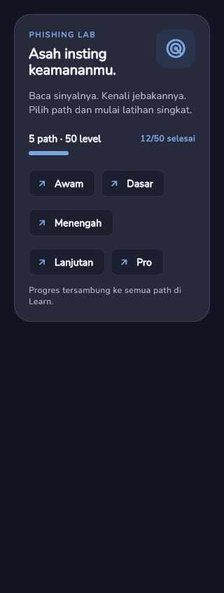
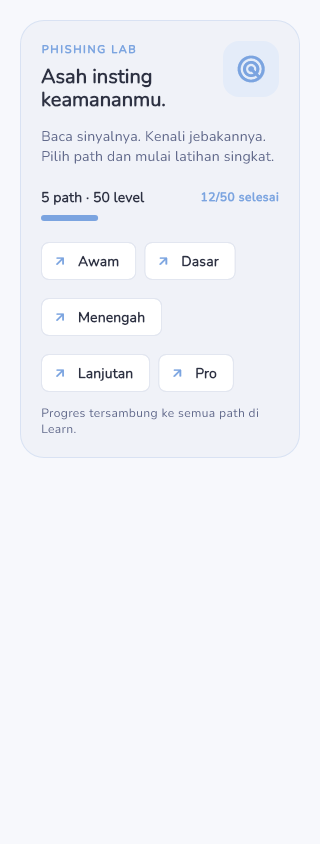
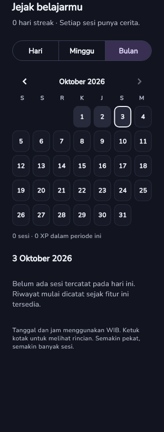
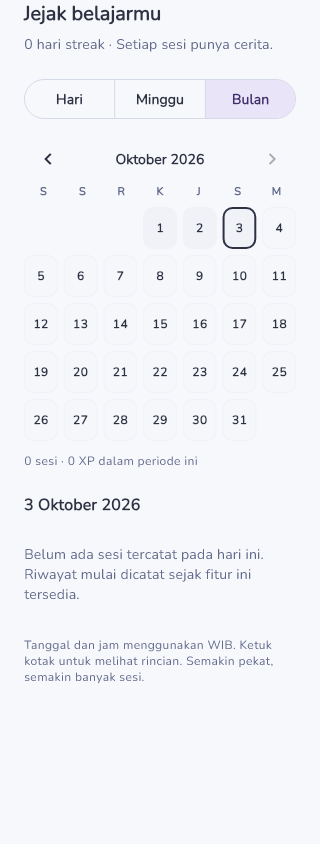
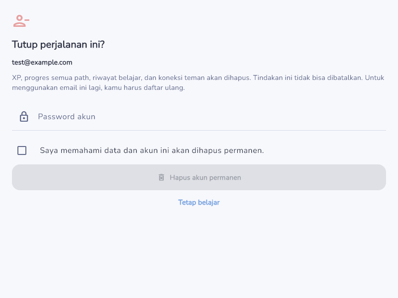

# 🛡️ SecuriGo

### Learn. Practice. Protect.

**SecuriGo** is an interactive cybersecurity learning platform designed to help users learn and practice cybersecurity in a simple, structured, and engaging way.

SecuriGo combines structured learning materials, interactive practice, progress tracking, gamification, and social features to create a more engaging cybersecurity learning experience.

The goal of SecuriGo is to make cybersecurity education more accessible and encourage users to develop better digital security awareness through continuous learning and practice.

---

## 🚀 Overview

Cybersecurity is becoming increasingly important as more activities move into the digital world. However, cybersecurity learning can often feel complicated, technical, and difficult for beginners.

SecuriGo approaches this problem by transforming cybersecurity education into an interactive learning experience.

Users can:

- 📚 Learn cybersecurity through structured learning paths
- 🎯 Practice their knowledge through interactive questions
- 📈 Track their learning progress
- 🏆 Compete through a leaderboard
- 👤 Manage their personal profile
- 🔥 Maintain learning activities and streaks
- 🌙 Switch between Dark Mode and Light Mode
- 🔐 Securely authenticate using Firebase
- ☁️ Synchronize application data using Cloud Firestore

---

# ✨ Features

## 📚 Structured Learning

SecuriGo provides structured cybersecurity learning materials organized into learning paths.

Users can progress through different lessons and gradually build their cybersecurity knowledge.

The learning system is designed to make complex cybersecurity concepts easier to understand by presenting them in smaller and more manageable sections.

---

## 🎯 Practice & Quiz

Users can test their understanding through interactive cybersecurity questions.

Practice content includes cybersecurity awareness topics such as:

- Phishing
- Suspicious messages
- Online security
- Digital safety
- Cybersecurity awareness

The practice system allows users to apply what they have learned instead of only reading theoretical material.

---

## 📈 Progress Tracking

SecuriGo tracks the user's learning progress.

Users can monitor:

- Completed lessons
- Learning progress
- XP
- Learning activity
- Course progress
- Practice results

This allows users to understand their learning development over time.

---

## 🏆 Leaderboard

SecuriGo includes a leaderboard system that allows users to compare their learning progress with other users.

The leaderboard is designed as part of the application's gamification system to encourage users to stay active and continue learning.

---

## 👤 User Profile

Users have their own profile containing information related to their learning activity.

The profile can display:

- User information
- XP
- Learning statistics
- Course progress
- Learning activity
- Ranking information

---

## 🔥 Learning Activity & Streak

SecuriGo records learning activities to encourage users to study consistently.

The activity system helps users visualize their learning habits and maintain a regular learning routine.

---

## 🌙 Dark Mode & Light Mode

SecuriGo supports both:

- 🌙 Dark Mode
- ☀️ Light Mode

Users can choose the interface appearance based on their preference and environment.

---

## 🔐 Authentication

SecuriGo uses **Firebase Authentication** to provide user authentication.

Authentication allows users to securely access their personal account and application data.

---

## ☁️ Cloud Firestore

SecuriGo integrates **Cloud Firestore** for cloud-based data management.

Firestore is used to support application features such as:

- User data
- Learning progress
- Leaderboard data
- Activity data
- Account-related data

---

## 🗑️ Account Management

SecuriGo provides account management functionality, including the ability for users to delete their account.

This gives users greater control over their account and application data.

---

# 🖼️ Application Preview

## Practice

<p align="center">
  
  
</p>

<p align="center">
  <b>Dark Mode</b>
  &nbsp;&nbsp;&nbsp;&nbsp;&nbsp;&nbsp;
  <b>Light Mode</b>
</p>

---

## Learning Activity

<p align="center">
  
  
</p>

<p align="center">
  <b>Dark Mode</b>
  &nbsp;&nbsp;&nbsp;&nbsp;&nbsp;&nbsp;
  <b>Light Mode</b>
</p>

---

## Account Management

<p align="center">
  
</p>

---

# 🏗️ Technology Stack

SecuriGo is built using modern cross-platform technologies.

| Technology | Purpose |
|---|---|
| **Flutter** | Cross-platform application development |
| **Dart** | Main programming language |
| **Firebase Authentication** | User authentication |
| **Cloud Firestore** | Cloud database |
| **Google Fonts** | Application typography |
| **HTTP** | Network/API communication |
| **Flutter Test** | Automated testing |
| **Git & GitHub** | Version control and collaboration |

---

# 📁 Project Structure

```text
LOMBA_LOMBA/
│
├── android/
├── ios/
├── macos/
├── windows/
├── web/
│
├── assets/
│   ├── data/
│   └── fonts/
│
├── artifacts/
│   └── previews/
│
├── firebase/
│   ├── firestore.rules
│   └── README.md
│
├── lib/
│   │
│   ├── components/
│   │   ├── leaderboard/
│   │   ├── lesson/
│   │   └── profile/
│   │
│   ├── data/
│   │   ├── level_data.dart
│   │   └── phishing_questions.dart
│   │
│   ├── models/
│   │
│   ├── screens/
│   │   ├── auth/
│   │   ├── edit_profile/
│   │   ├── home/
│   │   ├── leaderboard/
│   │   ├── onboarding/
│   │   ├── practice/
│   │   ├── profile/
│   │   ├── settings/
│   │   └── splash/
│   │
│   ├── services/
│   │
│   ├── state/
│   │
│   ├── widgets/
│   │
│   ├── app.dart
│   └── main.dart
│
├── test/
│
├── pubspec.yaml
└── README.md
```

---

# ⚙️ Getting Started

Follow the steps below to run SecuriGo locally.

## Requirements

Make sure the following tools are installed:

- [Flutter](https://flutter.dev/)
- Dart SDK
- Android Studio / Android SDK
- VS Code or another compatible IDE
- Git

Check your Flutter installation:

```bash
flutter doctor
```

---

## 1. Clone the Repository

Clone the repository using Git:

```bash
git clone https://github.com/JSAN007/LOMBA_LOMBA.git
```

Move into the project directory:

```bash
cd LOMBA_LOMBA
```

---

## 2. Install Dependencies

Install all Flutter dependencies:

```bash
flutter pub get
```

---

## 3. Check Available Devices

Run:

```bash
flutter devices
```

Make sure at least one Android device, emulator, desktop device, or supported platform is available.

---

## 4. Run the Application

Run SecuriGo using:

```bash
flutter run
```

To run on a specific device:

```bash
flutter run -d <device-id>
```

For example:

```bash
flutter run -d chrome
```

---

# 🔥 Firebase Configuration

SecuriGo uses Firebase for authentication and cloud data storage.

Before running features that require Firebase, make sure the Firebase project configuration is correctly connected to the application.

The required Firebase services include:

- Firebase Authentication
- Cloud Firestore

Firebase configuration may differ depending on the target platform.

For local development, make sure the required Firebase configuration files are available for the platform being used.

---

# 🧪 Testing

SecuriGo includes automated tests to help verify application functionality.

Run all tests:

```bash
flutter test
```

Run a specific test:

```bash
flutter test test/widget_test.dart
```

Example test areas include:

- Account functionality
- Account deletion
- Learning activity
- Course progress
- Leaderboard
- Navigation
- Dark Mode
- Friends functionality
- Widget behavior

---

# 🌳 Git Workflow

SecuriGo uses Git and GitHub for collaborative development.

The main branch is:

```text
main
```

Feature development is performed using separate branches.

Example:

```text
main
 │
 ├── feature/example-feature
 │
 ├── dark-light-mode
 │
 └── other-feature
```

After a feature has been completed and tested, it can be submitted through a Pull Request to the `main` branch.

---

## Create a New Feature Branch

Update the main branch first:

```bash
git switch main
git pull origin main
```

Create a new feature branch:

```bash
git switch -c feature/feature-name
```

---

## Commit Changes

After making changes:

```bash
git add .
```

Create a commit:

```bash
git commit -m "description of changes"
```

---

## Push the Branch

```bash
git push -u origin feature/feature-name
```

After pushing, create a Pull Request on GitHub and merge it into `main` after the feature has been reviewed and tested.

---

# 🎯 Project Goals

SecuriGo is developed with several main goals.

### Accessibility

Make cybersecurity learning easier to access and understand, especially for users who are still new to cybersecurity.

### Interactivity

Provide an experience where users can actively practice cybersecurity concepts instead of only reading theoretical material.

### Engagement

Use gamification elements such as XP, progress, streaks, and leaderboards to encourage continuous learning.

### Awareness

Help users recognize common cybersecurity threats and develop safer digital habits.

### Scalability

Build the application with a structure that allows additional cybersecurity learning materials and features to be added in the future.

---

# 🔮 Future Development

SecuriGo can be further developed with additional features such as:

### 🤖 AI-Powered Phishing Analysis

An AI-based feature that can analyze suspicious messages, emails, or links and provide users with an explanation of potential phishing indicators.

### 🧠 Personalized Learning

Learning recommendations based on the user's progress, practice results, and learning activity.

### 🏅 Achievement System

Additional badges, achievements, and rewards for users who complete specific learning challenges.

### 🎮 Interactive Cybersecurity Challenges

Scenario-based cybersecurity challenges that simulate real-world situations.

### 📊 Advanced Analytics

More detailed learning analytics for tracking user performance and identifying areas that need improvement.

### 🌐 Expanded Learning Modules

Additional cybersecurity topics covering areas such as:

- Password security
- Social engineering
- Malware
- Network security
- Privacy
- Account security
- Safe browsing
- Digital identity

### 👥 Social Learning

More social features that allow users to interact, compete, and learn together.

---

# 💡 Why SecuriGo?

Cybersecurity education should not only focus on delivering information.

Users also need opportunities to:

**Learn → Practice → Track Progress → Improve**

SecuriGo combines these elements into a single learning experience.

The platform is designed to make cybersecurity learning more approachable while encouraging users to continuously improve their knowledge and awareness.

---

# 🛡️ SecuriGo Philosophy

```text
        LEARN
          ↓
       PRACTICE
          ↓
        APPLY
          ↓
        IMPROVE
          ↓
        PROTECT
```

> **The more you understand cybersecurity, the better you can protect yourself in the digital world.**

---

# 👥 Team

**SecuriGo Team**

Developed as a technology innovation project and competition prototype.

---

# 📄 License

This project is currently developed as a project prototype for educational and competition purposes.

Unauthorized redistribution or commercial use of this project is not permitted without permission from the development team.

---

<p align="center">

## 🛡️ SecuriGo

### Learn. Practice. Protect.

Built with ❤️ using Flutter.

</p>
